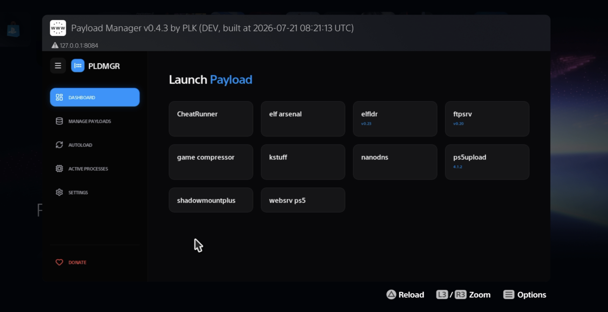

 

<h1 align="center">PS5 Payload Manager</h1>

A modern, web-based dashboard to easily manage, import, and automatically load payloads on your PS5.

  

 

# This is an unofficial community fork of itsPLK's PS5 Payload Manager. 
- It is not maintained or supported by the upstream project.

## Features
- **Web-Based Interface**: A modern dashboard to manage payloads from your PC, phone, or directly on the PS5.
- **Import Payloads**: Easily add new payloads from a USB drive or download them from the integrated cloud repository.
- **Automated Startup**: Configure payloads to launch automatically whenever Payload Manager starts.
- **Home Screen Shortcut**: Installs a dedicated **Payload Manager** app icon on the PS5 Home Screen for one-click access.
- **Launcher Manager** *(New)*: Verify, repair, or reinstall the Payload Manager Home Screen launcher directly from **Settings → System Tools**.
- **Launcher Diagnostics** *(New)*: Check the status of launcher files (`param.json` and `icon0.png`) and verify whether the launcher installation is healthy.
- **Remote Launcher Recovery** *(New)*: Restore a missing Payload Manager launcher from any web browser (PC or phone) without using FTP or manually editing the PS5 database.
- **Auto-Close Disc Player**: Optional setting to automatically terminate the Disc Player on startup (recommended for BD-JB users).

## Backend Endpoints

- `GET /launcher_status`
- `POST /launcher_repair`
- `POST /launcher_reinstall`

## Tested
Tested on:

- **PS5 firmware:** 11.20
- **Payload Manager base:** v0.4.2
- **Custom build:** v0.4.3 development build
- **Access methods:** PS5 browser and remote phone browser
- **Frontend build:** `npm run build`
- **Full ELF build:** `make clean all`

Verified functionality:

- Launcher Manager loads under **Settings → System Tools**
- `GET /launcher_status` returns valid launcher status data
- Missing `param.json` and `icon0.png` are detected
- Deleting the Payload Manager Home Screen shortcut is detected as a missing launcher
- Payload Manager remains remotely accessible at `http://PS5_IP:8084`
- **Repair** recreates the launcher files
- **Repair** restores the Payload Manager shortcut to the PS5 Home Screen
- Status automatically returns to **Ready** after a successful repair
- Existing Dashboard, Manage Payloads, Autoload, Active Processes, and Settings pages continue to load normally

## Known limitations

- PS5 shell registration is displayed as **Unknown** because the available SDK does not provide a reliable read-only registration query.
- The **Verify** action refreshes the launcher status but currently provides limited visual feedback when no status change occurs.
- The repair workflow was tested successfully after deleting the launcher. The destructive **Reinstall** workflow should receive additional testing before release.

## Installation

### Using an Autoloader (Recommended)
It is highly recommended to use **Payload Manager** together with an **Autoloader**:

[Y2JB](https://github.com/itsPLK/ps5-y2jb-autoloader) | [BD-JB](https://github.com/itsPLK/ps5-bdjb-autoloader) | [Lua](https://github.com/itsPLK/ps5-lua-autoloader)

`pldmgr.elf` is already included as the default payload in the latest versions of the Autoloaders linked above.

If you are using an older version and don't want to update the entire autoloader, you can simply:
1. Place `pldmgr.elf` into your `autoload` directory.
2. Add `pldmgr.elf` as the only entry in your `autoload.txt` config file.

### Standalone / Manual Loading
You can also manually load the manager like any other `.elf` file. Grab the latest version from the [Releases](https://github.com/itsPLK/ps5-payload-manager/releases) page.

## Custom Repositories
You can add third-party payload repositories to the manager. To learn how to create your own repository JSON and host it, see the [Custom Repositories Guide](CUSTOM_REPOSITORIES.md).

## Translations
PS5 Payload Manager supports multiple languages thanks to the community! 
If you'd like to help translate the app into your native language or improve existing translations, please visit our [Crowdin project](https://crowdin.com/project/ps5-payload-manager). 
All translations are managed exclusively through Crowdin.

**Translation Guidelines:**
- Please only submit translations in languages you are fluent in.
- Only translate strings when you know exactly what they mean in the context of the app. If you're unsure, it's much better to leave it untranslated than to guess incorrectly.
- *Pro Tip:* The best way to translate is to have the Payload Manager running on your PS5 or browser so you can navigate the UI and see the exact context of the buttons and descriptions you are translating!

### Supported Languages
| Language | Progress | Translator(s) |
| :--- | :---: | :--- |
| **Chinese Simplified** |  | [owendswang](https://crowdin.com/profile/owendswang) |
| **German** |  | [xEasy4Breezy](https://crowdin.com/profile/xEasy4Breezy) |
| **Italian** |  | [Leon90](https://crowdin.com/profile/Leon90) |
| **Persian** |  | [Epinor](https://crowdin.com/profile/Epinor) |
| **Polish** |  | [najdek](https://crowdin.com/profile/najdek) |
| **Portuguese, Brazilian** |  | [slipttees](https://crowdin.com/profile/slipttees), [matmarson](https://crowdin.com/profile/matmarson), [marcusvrb](https://crowdin.com/profile/marcusvrb) |
| **Russian** |  | [Akela-1979](https://crowdin.com/profile/Akela-1979) |
| **Spanish** |  | [Slayver95](https://crowdin.com/profile/Slayver95), [kXmpX](https://crowdin.com/profile/kXmpX) |
| **Turkish** |  | [Sezar61](https://crowdin.com/profile/Sezar61) |
| **Ukrainian** |  | [Mikeeee](https://crowdin.com/profile/Mikeeee) |

## Credits
- [John Törnblom](https://github.com/john-tornblom) - for the [shell UI installer](https://github.com/ps5-payload-dev/ftpsrv/blob/master/install-ps5.c) and various payloads used as reference.
- [BenNoxXD](https://github.com/BenNoxXD) - for the [Disc Player App termination logic](https://github.com/BenNoxXD/PS5-BDJ-HEN-loader/blob/main/HENloader_C_part/src/kill_disc_player.c).
- [owendswang](https://github.com/owendswang) - for [contributions](https://github.com/itsPLK/ps5-payload-manager/commits/main/?author=owendswang)
- Everyone else contributing to the PS5 homebrew scene.

## Donations
If you'd like to support my work, please check out the [DONATE.md](DONATE.md) file.

## Development
For build instructions and deployment details, see [DEVELOPMENT.md](DEVELOPMENT.md).
